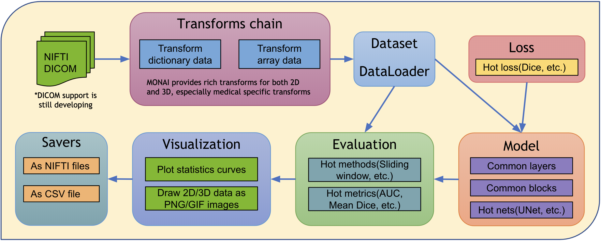

# Modules for public alpha

MONAI aims at supporting deep learning in medical image analysis at multiple granularities.
This figure shows modules currently available in the codebase.

The rest of this page provides more details for each module.

* [Image transformations](#image-transformations)
* [Loss functions](#losses)
* [Network architectures](#network-architectures)
* [Evaluation](#evaluation)
* [Visualization](#visualization)
* [Result writing](#result-writing)

## Image transformations
Medical image data pre-processing is challenging.  Data are often in specialized formats with rich meta-information, and the data volumes are often high-dimensional and requiring carefully designed manipulation procedures. As an important part of MONAI, powerful and flexible image transformations are provided to enable user-friendly, reproducible, optimized medical data pre-processing pipeline.

### 1. Transforms support both Dictionary and Array format data
1. The widely used computer vision packages (such as ``torchvision``) focus on spatially 2D array image processing. MONAI provides more domain-specific transformations for both spatially 2D and 3D and retains the flexible transformation "compose" feature.
2.  As medical image preprocessing often requires additional fine-grained system parameters, MONAI provides transforms for input data encapsulated in a python dictionary. Users are able to specify the keys corresponding to the expected data fields and system parameters to compose complex transformations.

### 2. Medical specific transforms
MONAI aims at providing a rich set of popular medical image specific transformations. These currently include, for example:


- `LoadNifti`:  Load Nifti format file from provided path
- `Spacing`:  Resample input image into the specified `pixdim`
- `Orientation`: Change the image's orientation into the specified `axcodes`
- `RandGaussianNoise`: Perturb image intensities by adding statistical noises
- `IntensityNormalizer`: Intensity Normalization based on mean and standard deviation
- `Affine`: Transform image based on the affine parameters
- `Rand2DElastic`: Random elastic deformation and affine in 2D
- `Rand3DElastic`: Random elastic deformation and affine in 3D

### 3. Fused spatial transforms and GPU acceleration
As medical image volumes are usually large (in multi-dimensional arrays), pre-processing performance obviously affects the overall pipeline speed. MONAI provides affine transforms to execute fused spatial operations, supports GPU acceleration via native PyTorch to achieve high performance.
Example code:
```py
# create an Affine transform
affine = Affine(
    rotate_params=np.pi/4,
    scale_params=(1.2, 1.2),
    translate_params=(200, 40),
    padding_mode='zeros',
    device=torch.device('cuda:0')
)
# convert the image using interpolation mode
new_img = affine(image, spatial_size=(300, 400), mode='bilinear')
```

### 4. Randomly crop out batch images based on positive/negative ratio
Medical image data volume may be too large to fit into GPU memory. A widely-used approach is to randomly draw small size data samples during training. MONAI currently provides general random sampling strategies including class-balanced fixed ratio sampling which may help stabilize the patch-based training process.

### 5. Deterministic training for reproducibility
Deterministic training support is necessary and important in DL research area, especially when sharing reproducible work with others. Users can easily set the random seed to all the transforms in MONAI locally and will not affect other non-deterministic modules in the user's program.
Example code:
```py
# define a transform chain for pre-processing
train_transforms = monai.transforms.compose.Compose([
    LoadNiftid(keys=['image', 'label']),
    ... ...
])
# set determinism for reproducibility
train_transforms.set_random_state(seed=0)
np.random.seed(0)
torch.manual_seed(0)
torch.backends.cudnn.deterministic = True
torch.backends.cudnn.benchmark = False
```

### 6. Cache IO and transforms data to accelerate training
Medical image data volume is usually very large and users need to train many
epochs(even more than 1000 epochs) to achieve expected metrics. The typical PyTorch program repeatedly loads data and run transforms for every epoch during training, which is time-consuming operation and unnecessary.  
MONAI provides cache mechanism to obviously optimize this situation that runs transforms before training and caches the result before the first non-deterministic transform in the chain. Then the training program only needs to load the cached data and run the random transforms. The optimized training speed can be even more than 10x faster than the original speed.


## Losses
There are domain-specific loss functions in the medical research area which are different from the generic computer vision ones. As an important module of MONAI, these loss functions are implemented in PyTorch, such as Dice loss and generalized Dice loss.

## Network architectures
Some deep neural network architectures have shown to be particularly effective for medical imaging analysis tasks. MONAI implements reference networks with the aims of both flexibility and code readability.  
In order to leverage the common network layers and blocks, MONAI provides several predefined layers and blocks which are compatible with 1D, 2D and 3D networks. Users can easily integrate the layer factories in their own networks.  
For example:  
```py
# add Convolution layer to the network which is compatible with different spatial dimensions.
dimension = 3
name = Conv.CONVTRANS
conv_type = Conv[name, dimension]
add_module('conv1', conv_type(in_channels, out_channels, kernel_size=1, bias=False))
```

## Evaluation
To run model inferences and evaluate the model quality, MONAI provides reference implementations for the relevant widely-used approaches. Currently, several popular evaluation metrics and inference patterns are included:

### 1. Sliding window inference
When executing inference on large medical images, the sliding window is a popular method to achieve high performance with flexible memory requirements.
1. Select continuous windows on the original image.
2. Execute a batch of windows on the model per time, and complete all windows.
3. Connect all the model outputs to construct one segmentation corresponding to the original image.
4. Save segmentation result to file or compute metrics.


### 2. Metrics for medical tasks
There are many useful metrics to measure medical specific tasks, MONAI already implemented Mean Dice and AUC, will integrate more soon.

## Visualization
Besides common curves of statistics on TensorBoard, in order to provide straight-forward checking of 3D image and the corresponding label and segmentation output, MONAI can visualize 3D data as GIF animation on TensorBoard which can help users quickly check the model output.

## Result writing
For the segmentation task, MONAI supports to save the model output as NIFTI format image and add affine information from the corresponding input image.

For the classification task, MONAI supports to save classification result as a CSV file.
